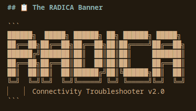
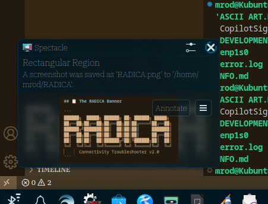

# 🌟 RADICO
## Network Connectivity Troubleshooter v2.0

```
██████╗  █████╗ ██████╗ ██╗ ██████╗ ██████╗ 
██╔══██╗██╔══██╗██╔══██╗██║██╔════╝██╔═══██╗
██████╔╝███████║██║  ██║██║██║     ██║   ██║
██╔══██╗██╔══██║██║  ██║██║██║     ██║   ██║
██║  ██║██║  ██║██████╔╝██║╚██████╗╚██████╔╝
╚═╝  ╚═╝╚═╝  ╚═╝╚═════╝ ╚═╝ ╚═════╝ ╚═════╝ 
...

[](https://github.com/odioski/RADICO)
[](https://github.com/odioski/RADICO)
[](LICENSE)
[](https://github.com/odioski/RADICO)

---

## 🚀 What is RADICO?

**RADICO** is a revolutionary network connectivity troubleshooter that combines traditional diagnostic tools with cutting-edge AI technology. Whether you're dealing with Ethernet issues, WiFi problems, or Bluetooth connectivity challenges, RADICO has you covered across all major Linux distributions.

### ✨ Key Features

- 🔧 **Multi-Platform Support**: Works seamlessly on Debian/Ubuntu, RedHat/CentOS/Fedora, Arch Linux, and openSUSE
- 🤖 **AI-Powered Diagnostics**: Integration with OpenAI GPT-4, Anthropic Claude, Perplexity AI, and local Ollama
- 🌐 **Comprehensive Coverage**: Ethernet, WiFi, and Bluetooth troubleshooting in one tool
- 📦 **Smart Dependencies**: Automatically handles package conflicts and missing repositories
- 🎨 **Customizable Interface**: Multiple color schemes and themes
- 📊 **Advanced Logging**: Comprehensive session logging with customizable file names
- ⚡ **Auto-Installation**: Checks and installs missing network utilities automatically

---

## 🏃‍♂️ Quick Start

### Basic Usage
```bash
# Download and run RADICO
chmod +x radicol
./radicol

# Enable AI features with dark color profile and logging
./radicol --ai-enabled --color-profile dark --log-file network_debug.log

# Get direct AI help
./radicol --ai-help openai "WiFi connects but no internet"
```

## Color Profiles

The script supports multiple color profiles for different preferences and terminal themes:

- **default**: Standard terminal colors
- **professional**: Muted professional colors  
- **high-contrast**: High contrast colors for accessibility
- **monochrome**: Grayscale colors
- **dark**: Optimized for dark themes

The script will also automatically detect and load color profiles from:
- `~/.config/radicol/colors/`
- `~/.radicol_colors`
- `~/.config/terminal/colors/`
- `~/.local/share/color-schemes/`
- `~/.kde/share/apps/konsole/`
- `~/.config/konsole/`

## Logging

The script offers comprehensive logging capabilities:

- **Interactive setup**: Choose whether to enable logging during startup
- **Custom log files**: Specify your own log file name or use default `radicol.log`
- **Command line option**: Enable logging directly with `--log-file filename.log`
- **Clean log format**: Timestamps and color-code-free entries for easy parsing
- **Session tracking**: Complete record of troubleshooting steps and results

### Logging Examples

```bash
# Enable logging interactively (will prompt for log file name)
./radicol

# Specify log file via command line
./radicol --log-file my_network_debug.log

# Use default log file name
./radicol --log-file radicol.log
```

## Dependencies

### Debian/Ubuntu (apt)
```bash
sudo apt install iproute2 net-tools ethtool iputils-ping traceroute dnsutils \
wireless-tools iw rfkill wpasupplicant bluez curl jq
```

### RedHat/CentOS/Fedora (dnf/yum)
```bash
sudo dnf install iproute net-tools ethtool iputils traceroute bind-utils \
wireless-tools iw rfkill wpa_supplicant bluez curl jq
```

### Arch Linux (pacman)
```bash
sudo pacman -S iproute2 net-tools ethtool iputils traceroute bind \
wireless_tools iw rfkill wpa_supplicant bluez curl jq
```

### openSUSE (zypper)
```bash
sudo zypper install iproute2 net-tools ethtool iputils traceroute bind-utils \
wireless-tools iw rfkill wpa_supplicant bluez curl jq
```

## AI Setup (Optional)

```bash
# OpenAI
export OPENAI_API_KEY="your-api-key"

# Anthropic Claude
export ANTHROPIC_API_KEY="your-api-key"

# Perplexity AI
export PERPLEXITY_API_KEY="your-api-key"

# Local AI (Ollama)
curl -fsSL https://ollama.ai/install.sh | sh
ollama pull llama2
```

## Permissions

Some diagnostic commands require elevated privileges. The script will:
- **Automatically request sudo** when needed for package installation
- **Gracefully handle** commands that need root access
- **Suggest alternatives** when sudo isn't available

> 💡 **Tip**: For best results, consider running with `sudo ./radicol` or ensure your user is in the `sudo` group.

## Usage

```bash
./radicol [OPTIONS]

Options:
  --ai-enabled                Enable AI troubleshooting features
  --ai-help SERVICE QUERY     Get AI assistance
  --color-profile PROFILE     Set color profile
  --log-file FILENAME         Enable logging to specified file
  --help, -h                  Show help message

Color Profiles:
  default       Standard terminal colors
  professional  Muted professional colors
  high-contrast High contrast colors
  monochrome    Grayscale colors
  dark         Dark theme optimized

AI Services:
  openai       OpenAI GPT-4
  anthropic    Anthropic Claude  
  perplexity   Perplexity AI
  local        Local Ollama

Examples:
  ./radicol --ai-enabled --color-profile dark
  ./radicol --log-file debug_session.log
  ./radicol --ai-help openai "network interface down"
```

---

## 🎯 Supported Platforms

| Distribution | Status | Package Manager |
|-------------|---------|-----------------|
| Ubuntu/Debian | ✅ Full Support | apt |
| RedHat/CentOS/Fedora | ✅ Full Support | yum/dnf |
| Arch Linux | ✅ Full Support | pacman |
| openSUSE | ✅ Full Support | zypper |
| Other Linux | 🔄 Basic Support | Manual |

---

## 🤖 AI Integration

RADICO supports multiple AI providers for enhanced troubleshooting:

- **OpenAI GPT-4**: Advanced problem analysis
- **Anthropic Claude**: Detailed technical explanations  
- **Perplexity AI**: Real-time web-based solutions
- **Local Ollama**: Privacy-focused offline AI

### AI Configuration
```bash
# Set your preferred AI provider
export RADICO_AI_PROVIDER="openai"
export OPENAI_API_KEY="your-api-key-here"

# Or use local Ollama
export RADICO_AI_PROVIDER="ollama"
```

---

## 📸 Screenshots

### Main Interface


### Advanced Diagnostics


---

## 📚 Documentation

- 📖 [User Manual](NFO.md)
- 🎨 [ASCII Art Guide](ASCII%20ART.NFO.md)
- 📊 [Development Notes](DEVELOPMENT_SESSION_SUMMARY.md)
- 🔍 [Session Reports](REPORTS/)

---

## 🤝 Contributing

We welcome contributions to RADICO! Here's how you can help:

1. **Fork** the repository
2. **Create** a feature branch (`git checkout -b feature/amazing-feature`)
3. **Commit** your changes (`git commit -m 'Add amazing feature'`)
4. **Push** to the branch (`git push origin feature/amazing-feature`)
5. **Open** a Pull Request

### Development Setup
```bash
git clone https://github.com/odioski/RADICO.git
cd RADICO
# Start developing!
```

---

## 📞 Support

- 🐛 **Issues**: [GitHub Issues](https://github.com/odioski/RADICO/issues)
- 💬 **Discussions**: [GitHub Discussions](https://github.com/odioski/RADICO/discussions)
- 📧 **Email**: o.daniels.sr@outlook.com

---

## License

MIT License - Feel free to modify and distribute.

---

<div align="center">

**⭐ Star this repository if RADICO helped you solve your network issues! ⭐**

Made with ❤️ by [odioski](https://github.com/odioski)

</div>

---

*Originally conceived by Mr. Omar Daniels*  
*Developed collaboratively with GitHub Copilot*  
*A practical approach to network troubleshooting with modern AI assistance*