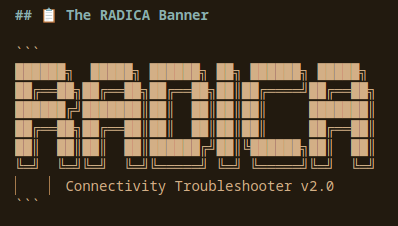
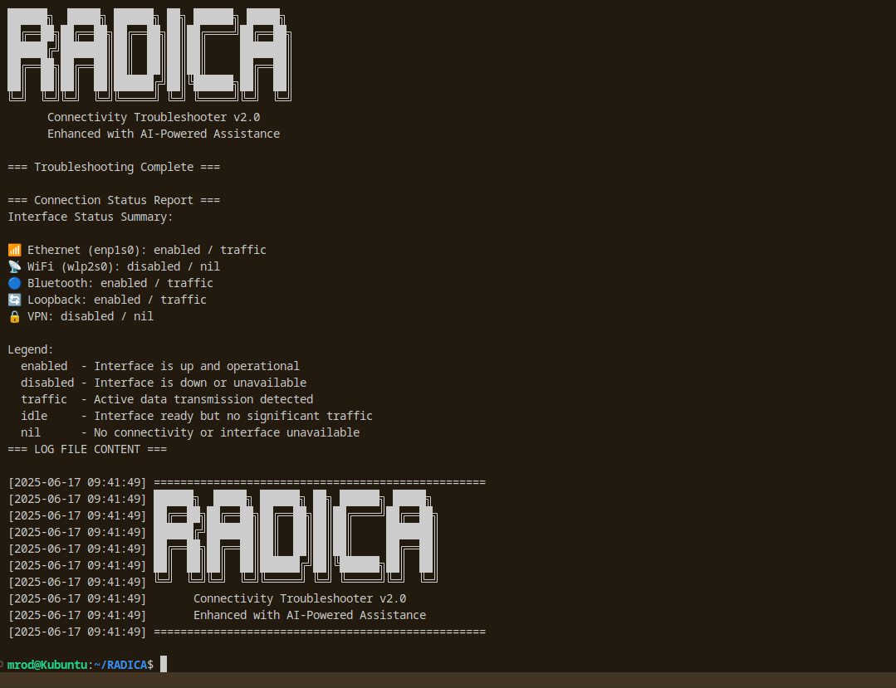

# 🌟 RADICA
## Network Connectivity Troubleshooter v2.0

```
██████╗  █████╗ ██████╗ ██╗ ██████╗ █████╗ 
██╔══██╗██╔══██╗██╔══██╗██║██╔════╝██╔══██╗
██████╔╝███████║██║  ██║██║██║     ███████║
██╔══██╗██╔══██║██║  ██║██║██║     ██╔══██║
██║  ██║██║  ██║██████╗██║╚██████╗██║  ██║
╚═╝  ╚═╝╚═╝  ╚═╝╚═════╝ ╚═╝ ╚═════╝╚═╝  ╚═╝
      Connectivity Troubleshooter v2.0
```

> **RADICA** - *A comprehensive network troubleshooting solution for Linux systems*

[](https://github.com/odioski/RADICA)]
[](https://github.com/odioski/RADICA)]
[](LICENSE)]

---

## 🚀 What is RADICA?

**RADICA** is a revolutionary network connectivity troubleshooter. Whether you're dealing with Ethernet issues, WiFi problems, or Bluetooth connectivity challenges, RADICA has you covered across all major Linux distributions.

### ✨ Key Features

- 🔧 **Multi-Platform Support**: Works seamlessly on Debian/Ubuntu, RedHat/CentOS/Fedora, Arch Linux, and openSUSE
- 🌐 **Comprehensive Coverage**: Ethernet, WiFi, and Bluetooth troubleshooting in one tool
- 📦 **Smart Dependencies**: Automatically handles package conflicts and missing repositories
- 🎨 **Customizable Interface**: Multiple color schemes and themes
- 📊 **Advanced Logging**: Comprehensive session logging with customizable file names
- ⚡ **Auto-Installation**: Checks and installs missing network utilities automatically

---

## 🏃‍♂️ Quick Start

### Basic Usage
```bash
# Download and run RADICA
chmod +x RADICA
./radica

# Use dark color profile and logging
./radica --color-profile dark --log-file network_debug.log
```

## Color Profiles

The script supports multiple color profiles for different preferences and terminal themes:

- **default**: Standard terminal colors
- **professional**: Muted professional colors  
- **high-contrast**: High contrast colors for accessibility
- **monochrome**: Grayscale colors
- **dark**: Optimized for dark themes

The script will also automatically detect and load color profiles from:
- `~/.config/RADICA/colors/`
- `~/.RADICA_colors`
- `~/.config/terminal/colors/`
- `~/.local/share/color-schemes/`
- `~/.kde/share/apps/konsole/`
- `~/.config/konsole/`

## Logging

The script offers comprehensive logging capabilities:

- **Interactive setup**: Choose whether to enable logging during startup
- **Custom log files**: Specify your own log file name or use default `RADICA.log`
- **Command line option**: Enable logging directly with `--log-file filename.log`
- **Clean log format**: Timestamps and color-code-free entries for easy parsing
- **Session tracking**: Complete record of troubleshooting steps and results

### Logging Examples

```bash
# Enable logging interactively (will prompt for log file name)
./radica

# Specify log file via command line
./radica --log-file my_network_debug.log

# Use default log file name
./radica --log-file RADICA.log
```

## Dependencies

### Debian/Ubuntu (apt)
```bash
sudo apt install iproute2 net-tools ethtool iputils-ping traceroute dnsutils \
wireless-tools iw rfkill wpasupplicant bluez curl jq
```

### RedHat/CentOS/Fedora (dnf/yum)
```bash
sudo dnf install iproute net-tools ethtool iputils traceroute bind-utils \
wireless-tools iw rfkill wpa_supplicant bluez curl jq
```

### Arch Linux (pacman)
```bash
sudo pacman -S iproute2 net-tools ethtool iputils traceroute bind \
wireless_tools iw rfkill wpa_supplicant bluez curl jq
```

### openSUSE (zypper)
```bash
sudo zypper install iproute2 net-tools ethtool iputils traceroute bind-utils \
wireless-tools iw rfkill wpa_supplicant bluez curl jq
```

## Permissions

Some diagnostic commands require elevated privileges. The script will:
- **Automatically request sudo** when needed for package installation
- **Gracefully handle** commands that need root access
- **Suggest alternatives** when sudo isn't available

> 💡 **Tip**: For best results, consider running with `sudo ./radica` or ensure your user is in the `sudo` group.

## Usage

```bash
./radica [OPTIONS]

Options:
  --color-profile PROFILE     Set color profile
  --log-file FILENAME         Enable logging to specified file
  --help, -h                  Show help message

Color Profiles:
  default       Standard terminal colors
  professional  Muted professional colors
  high-contrast High contrast colors
  monochrome    Grayscale colors
  dark         Dark theme optimized

Examples:
  ./radica --color-profile dark
  ./radica --log-file debug_session.log
```

---

## 🎯 Supported Platforms

| Distribution | Status | Package Manager |
|-------------|---------|-----------------|
| Ubuntu/Debian | ✅ Full Support | apt |
| RedHat/CentOS/Fedora | ✅ Full Support | yum/dnf |
| Arch Linux | ✅ Full Support | pacman |
| openSUSE | ✅ Full Support | zypper |
| Other Linux | 🔄 Basic Support | Manual |

---

## 📸 Screenshots

### Main Interface


### Advanced Diagnostics

Tiny example. Download [Radica Example Log.pdf](radica-example-log.pdf) to view the full current output.
---

## 📚 Documentation

- 📖 [User Manual](NFO.md)
- 🎨 [ASCII Art Guide](ASCII%20ART.NFO.md)
- 📊 [Development Notes](DEVELOPMENT_SESSION_SUMMARY.md)
- 🔍 [Session Reports](REPORTS/)

---

## 🤝 Contributing

We welcome contributions to RADICA! Here's how you can help:

**Fork** the repository
**Open** a Pull Request

## 💪🏾 Development Setup

      git clone https://github.com/odioski/RADICO.git
      cd RADICO
      su

### Additional tools...

Kate - Feature Rich IDE

      apt install kate

shfmt (Shell Format) - Like shellcheck works well w/Kate troubleshooting Shell Scripts (bash,sh,zsh,etc.)

      apt install shfmt

Bash LSP (Bash Language Server Processor/Protocol) - Plugin for Kate, in conjuction with shfmt.

      snap install bash-language-server --classic


Fish (CMD|CLI/Shell) - With Fish, if good enough or knowledgeable enough, you can skip the forementioned
and possibly speed up or shorten your dev time. This is due to intellisense like features
(highly developed) made available within the Fish shell.

      apt install fish

As a reminder, if unsure about any of these or any lib you're about to add/download,
you can always just info $(new_lib) and cross-check.

like ...

      apt info shfmt kate fish && snap info bash-language-server

## 📞 Support

- 🐛 **Issues**: [GitHub Issues](https://github.com/odioski/RADICA/issues)
- 💬 **Discussions**: [GitHub Discussions](https://github.com/odioski/RADICA/discussions)
- 📧 **Email**: link92@bookmotives.com

---

## License

MIT License - Feel free to modify and distribute.

---

<div align="center">

**⭐ Star this repository if RADICA helped you solve your network issues! ⭐**

Made with ❤️ by [odioski](https://github.com/odioski)

</div>

---

*Originally conceived by Mr. Omar Daniels, the TELCO, and crew.*

*AI assisted (Copilot - Claude) development.*

*A practical approach to network troubleshooting*
